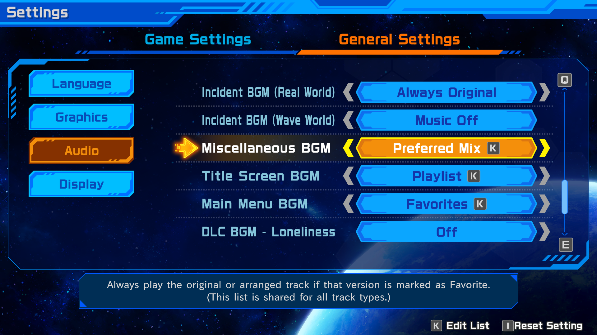

# MMSFLC Expanded Music Options

A mod for Mega Man Star Force Legacy Collection that adds options for customizing the in-game BGM.

## Features

This mod fully seamlessly integrated with the Legacy Collection's menus and adds a number of customization options to the Audio settings.

Here are some of the things this mod allows you to do:

* Customize the BGM being played for each type of track. Want the SF3 battle theme but the SF2 boss theme? You can do that.

* Prefer the Original mix for certain tracks, but the Arranged mix for other ones? With this mod you can freely choose Original or Arranged for each individual song.

* Play your Favorites in-battle, and use the Arranged soundtrack outside of battle.

* Change your BGM Favorites without having to exit the game.

* Replace the in-game music for Loneliness, Astro Wave, Anthem of the Solitary and Cheerful Indoors with the DLC special arrangements.

  _Requires the 'Geo Stelar and Omega-Xis Character Model Pack' DLC to be owned and installed._

* Customize the BGM being played on the Legacy Collection's Main Menu.

  _Requires a 'Character Model Pack' DLC to be owned and installed._

## Music Options

The customization options in this mod override the normal 'BGM Selection' setting in the base game.

The hierarchy is as following, from highest to lowest priority:

> DLC BGM setting > Custom BGM type setting > 'BGM Selection' base option

For each BGM type, you can choose the following settings. (Note that some settings are not available for every BGM type.)

* **No Change** - This BGM type is not overridden and will follow the normal 'BGM Selection' option.

* **Always Original** - The game will always play the Original version of the BGM.

* **Always Arranged** - The game will always play the Arranged version of the BGM.

* **Preferred Mix** - You can set for each track individually whether the game should use the Original or Arranged mix (or either!).

  By pressing the Confirm button on this option, you will be brought to the Music Player where you can mark songs as Favorite. Whichever version (Original or Arranged) of a song is marked as Favorite here will be played in-game.

  If you Favorite both the Original and Arranged versions of a song, the game will randomly choose each time the song is played.
  
  If neither version is favorited, then the game will play the Arranged version if 'BGM Selection' is set to 'Arranged', and the Original version otherwise.

  The custom list for 'Preferred Mix' is shared across all BGM types.

* **Playlist** - The game will randomly play songs from a custom playlist for this BGM type.

  By pressing the Confirm button on this option, you will be brought to the Music Player, where you can build a custom playlist by marking songs as Favorites.

  The custom list for 'Playlist' is separate for each BGM type.

* **Favorites** - The game will randomly play songs from your Favorites.

  By pressing the Confirm button on this option, you will be brought to the Music Player, where you can choose your Favorites.

  This option uses your regular list of Favorites. It is shared across all BGM types.

* **Music Off** - The game will not play any music.

Please note: The 'Playlist' and 'Favorites' options for Main Menu BGM are only available if a Character Model Pack DLC is installed.

## Save data

Saved playlists and settings pertaining to this mod are stored in the game's install folder under `reframework/data/ExpandedMusicOptions`.

Note that this mod's settings are not synced to Steam Cloud.

## Installing

Download the [latest release](https://github.com/Prof9/MMSFLC-Expanded-Music-Options/releases) and install using Fluffy Manager 5000.

## Building

See https://github.com/Prof9/REF-Plugin-Template/blob/main/readme.md for build instructions.

## AI disclosure

All code in this repository is human-written.

An LLM was used to assist with translating the new English menu options into Japanese and Chinese.
